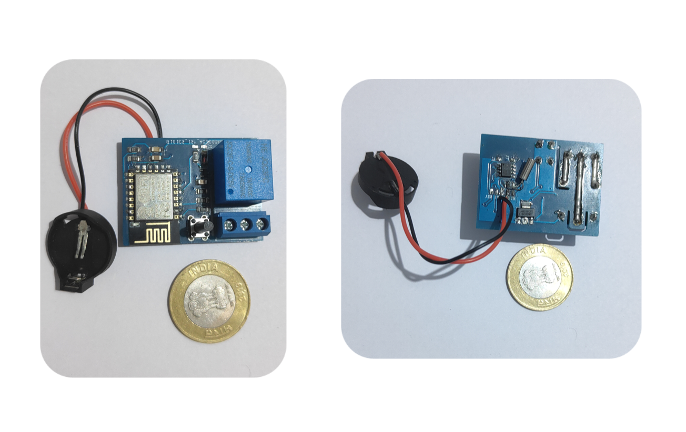
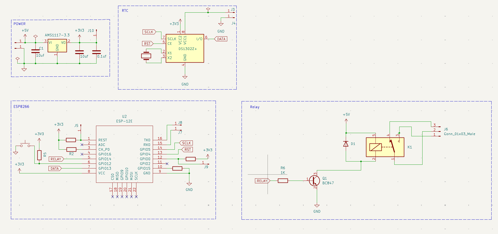
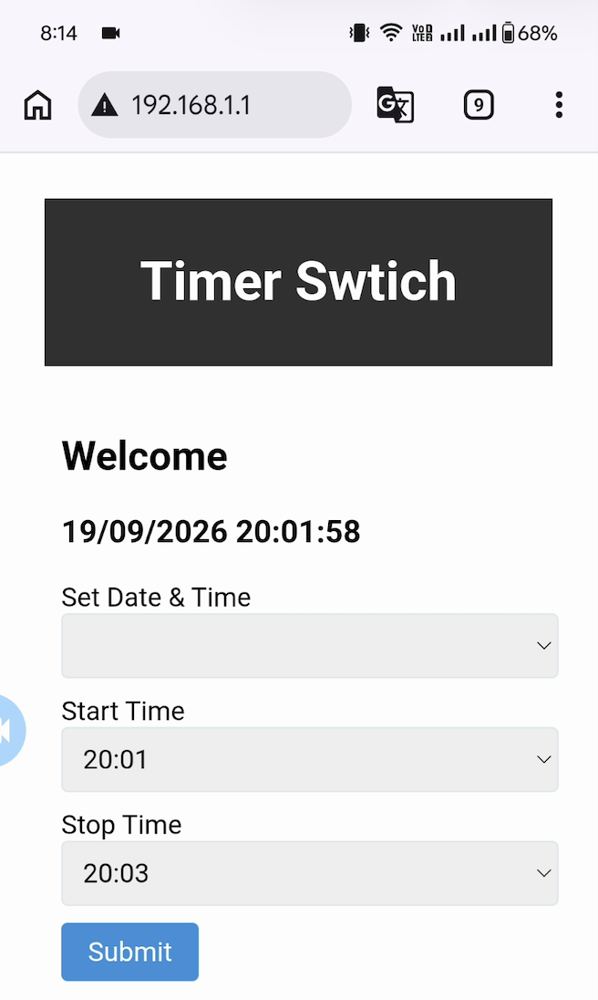
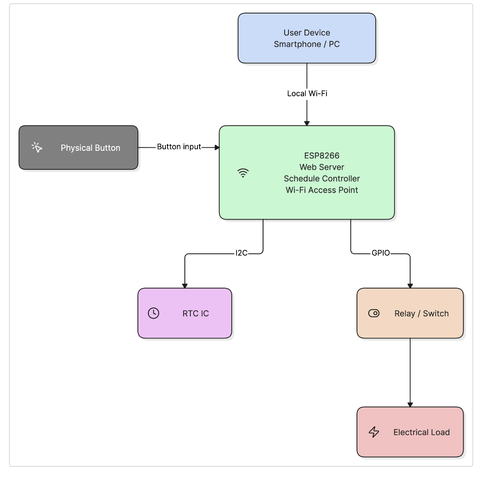

# Smart Timer Switch Using ESP8266 and RTC

A simple **Wi-Fi programmable timer switch** based on **ESP8266 and RTC**. It can automatically turn a connected device ON and OFF according to a configured schedule.

No internet connection is required. The timer creates its own local Wi-Fi network for configuration.

## Features

* 📡 ESP8266-based local Wi-Fi configuration
* ⏰ Real-time clock (RTC) for accurate timekeeping
* 🔌 5V relay for controlling electrical loads
* 🌐 Simple web-based configuration
* 🚫 No internet required
* 💾 Stores configuration locally
* 🔘 Physical button to enable configuration mode
* 📱 Configure using a mobile phone or computer

## Project Images

### Prototype



### Circuit Diagram




### Web Configuration



## YouTube

📺 **Watch the project demo:**  
[Smart Offline Programmable Timer Switch Using ESP8266 and RTC](https://youtube.com/shorts/wJGOkK_HlXM)

[](https://youtube.com/shorts/wJGOkK_HlXM)


## Main Blocks

The project mainly consists of four blocks:

1. **ESP8266** – Wi-Fi and controller
2. **5V Relay** – Controls the connected load
3. **Real-Time Clock (RTC)** – Keeps track of time
4. **Voltage Regulator** – Provides the required regulated voltage



## How It Works

1. Power on the timer switch.
2. Press and hold the configuration button.
3. The ESP8266 enables local Wi-Fi mode.
4. Connect your phone or computer to the timer's Wi-Fi network.
5. Open a browser and go to:

```text
192.168.1.1
```

6. Set the current time if required.
7. Configure the ON and OFF schedule.
8. The timer automatically controls the connected load according to the schedule.

## Hardware

* ESP8266
* DS1302 RTC
* 5V Relay Module
* AMS1117-3.3V Voltage Regulator
* Push Button
* Resistors and capacitors
* Power supply
* Connected load

## Configuration

The timer uses a local web interface, so you don't need a cloud service or internet connection.

Connect to the timer's Wi-Fi, open `192.168.1.1` in your browser, and configure the required schedule.

## Example

For example:

```text
ON  → 08:01 PM
OFF → 08:03 PM
```

The relay will automatically switch the connected load according to the configured schedule.

## Advantages

* Simple configuration
* No internet dependency
* No LCD or LED display required
* Easy to modify the schedule
* Low-cost hardware
* Useful for automatic switching applications

## Project Structure

```text
├── firmware/
├── img/
│   ├── block-diagram.png
│   ├── diagram.png
│   ├── img.png
│   └── pcb.png
├── PCB/
├── README.md
└── project-report.pages
```

## License

This project is open source. See the `LICENSE` file for details.
